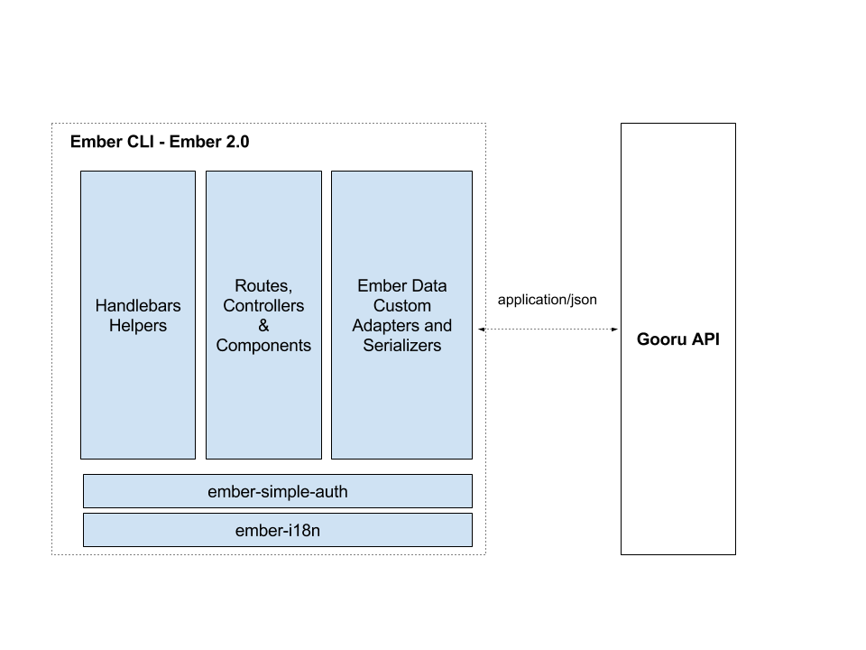

Gooru Web
=============
Introducing Gooru Web  - a solution to help teachers faciliate personalized learning for students.

## Introduction
Gooru Web is the front-end of the Gooru application. Gooru’s free solution enables teachers to create, curate, and share collections of web resources on any K-12 topic. With millions of multimedia resources and quiz questions, Gooru makes it easy to discover topic-relevant and standards-aligned content to address specific students’ needs.  At Gooru, we believe education is a human right.  Now, with access to this Git repository, open-sourced under the MIT license, you can build along side us to support this mission and help students around the world reach their full potential.

Gooru Web is developed using GWTP model-view-presenter framework to simplify the GWT implementation, followed by advanced Restlet client which will communicate with the high performance Gooru Restful Services. 

## Features:
Gooru’s features fall into four major groups: Discover, Organize, Teach and Study.  Here are short descriptions of each component. 

## Discover
Discover services provide the solution to search millions of resources, collections, and question items in the Gooru Learning Catalog. The Search APIs with the indexing support allow for filtering content or the Suggest APIs to personalize the experience by taking user activity and preferences into account.

## Organize
Organize services provide the solution for the registered users to create collections (multimedia lessons) which include resources such as videos, textbooks, interactives and question items. The Organize services allow you to access content and perform CRUD operations for collections, resources and question items.

## Teach
Teach services provide the solution to manage classes, create assignments, and track collection sessions. Teachers can create multiple Classpages, which are unique pages for different student groups accessible through URL or a “Class Code”. Each Classpage can have a set of assignments, with instructions and a date.

## Library
The Gooru Library is a brand new way to discover the best collections that the Gooru community has curated across core subject areas.

## Authentication
Create new accounts on Gooru using the authentication system or Gmail connect.

## Social
Share, flag and tag content, access a flexible rating system and protect your users with abuse reporting using Gooru Social services.

## Resource Player
This module is responsible for rendering Gooru Resources. Resources can be labeled with one of the following nine categories: Video, Website, Interactive, Question, Slide, Textbook, Handout, Lesson, Exam. The Resource Player is capable of rendering all of them. This player also provides functionality for sharing a Resource via Facebook, Twitter or Email.

## Collection Player
The Gooru Collection Player is capable of rendering all types of Gooru Collections including Quizzes, and other collections with Questions. The player module contains collection navigation, narration, summary, sharing out, and adding the resource/collection to the user’s Organize page.

## Prerequisites

You will need the following things properly installed on your computer.

* [Git](http://git-scm.com/)
* [Node.js](http://nodejs.org/) (with NPM)
* [Bower](http://bower.io/)
* [Ember CLI](http://www.ember-cli.com/)
* [PhantomJS](http://phantomjs.org/)

## High Level Architecture
This project is built on top of EmberJS 2.x and Ember CLI

#### Technology stack
* Ember CLI
* Ember 2.x
* Ember Simple Auth
* Ember i18n
* Handlebars
* SASS
* Boostrap
* jQuery

#### Project Structure
This project follows the project structure suggested by Ember CLI

#### Communication Layer - Custom Adapters and Serializers
EmberJS 2.x implements by default json:api specification for REST communication, custom EmberJS adapters and serializers are necessary to communitate and match the current Gooru's API end points convention. 

#### Authentication and Authorization
The library ember-simple-auth is used for authentication and authorization, it also track the user client session. See [Ember Simple Auth](http://ember-simple-auth.com/)

#### Internationalization
@TODO

## Installation

* `git clone https://github.com/Gooru/Gooru-FE.git` this repository
* change into the new directory
* `npm install`
* `bower install`

## Running / Development

* `ember server`
* Visit your app at [http://localhost:4200](http://localhost:4200).

### Coding standards
@TODO

### Code Generators

Make use of the many generators for code, try `ember help generate` for more details

### Git strategy
`Git Flow` strategy was selected, look at [Git Flow Workflow](https://www.atlassian.com/git/tutorials/comparing-workflows/gitflow-workflow/) and [Git Flow Cheatsheet](http://danielkummer.github.io/git-flow-cheatsheet/)

### Running Tests

* `ember test`
* `ember test --server`

### Mocking the api server - Stubby
@TODO

### Proxy-ing the api server
* `ember server --proxy your_server`

### Building

* `ember build` (development)
* `ember build --environment production` (production)

### Deploying

@TODO: Specify what it takes to deploy your app.

